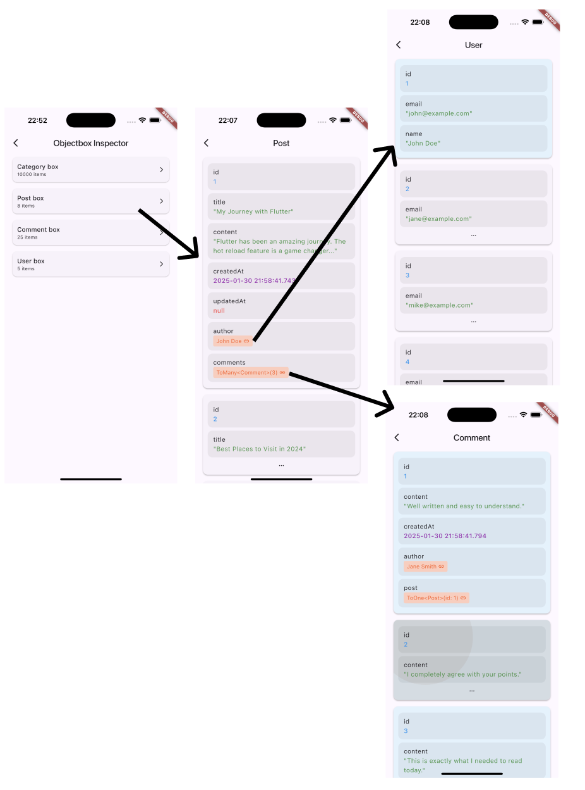

# Objectbox Inspector for Objectbox

[](https://pub.dev/packages/objectbox_inspector)

This package provides a visual interface for all the classes annotated with `@Entity` in [ObjectBox](https://pub.dev/packages/objectbox).



## Usage

To use the Objectbox Inspector, you need to add the `objectbox_inspector` and `objectbox_inspector_generator` dependency to your project.

> Note: Obviosly `objectbox` itself is required.

```yaml
dependencies:
  objectbox_inspector: ^0.0.1

dev_dependencies:
  objectbox_inspector_generator: ^0.0.1
```

After running `flutter pub get`, you can run the `objectbox_inspector` command to generate the inspector.

```bash
flutter pub get
flutter pub run build_runner build
```

This will generate a `objectbox.inspector.g.dart` file in your project. That contains the necessary code to run the inspector.

## Example

```dart
final store = openStore(); // need the Store instance...

// ...
IconButton(
    onPressed: () => openObjectboxInspector(
        context,
        getInspectableBoxes(store),
    ),
    icon: const Icon(Icons.bug_report),
),
// ...
```

